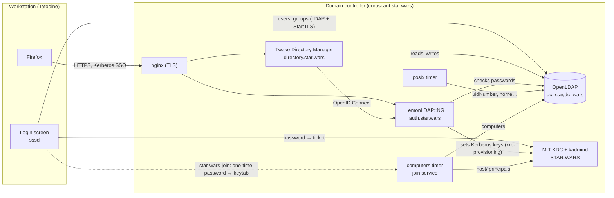

# Kerberos domain demo: Twake Directory Manager, LemonLDAP::NG and Star Wars

An Ansible playbook that builds a small Kerberos domain on Debian 13:

- a **domain controller** with the directory, the KDC, the SSO and the
  administration console;
- optionally, **Linux workstations** joined to the domain, with a desktop
  where users log in with their directory account and reach the web
  applications without typing their password again.

The galaxy is far, far away: the realm is `STAR.WARS`, and Han Solo, Leia
Organa and Dark Vador are waiting for you in the directory.

It is a demo: generated secrets, a self-signed CA, passwords equal to the
logins. Do not expose it.

## What you get



| Component               | Role                                                                                                                                                            |
| ----------------------- | --------------------------------------------------------------------------------------------------------------------------------------------------------------- |
| OpenLDAP                | The directory, with the Twake schema: users, organizations, groups                                                                                              |
| Twake Directory Manager | Administration console of the directory, delegated per organization                                                                                             |
| LemonLDAP::NG           | SSO portal and OpenID Connect provider; Kerberos SSO for domain workstations                                                                                    |
| MIT Kerberos            | The realm's KDC; LemonLDAP::NG keeps its keys in step with the directory passwords                                                                              |
| Workstations            | Debian 13 with sssd (identities from LDAP, passwords from Kerberos), XFCE and Firefox; managed as computers in the console, and joined with a one-time password |

## Who administers what in the galaxy

Rights in the console come from the organization tree: whoever is named
administrator of an organization manages it and everything below it.

```
organization                      yoda        (the whole directory)
├── Jedi Order                    okenobi
├── Rebel Alliance                lorgana
│   └── Rogue Squadron            wantilles   (lorgana too, from above)
├── Galactic Empire               dvador
│   └── Imperial Navy             wtarkin     (dvador too, from above)
└── Outer Rim                     lcalrissian
```

| Login                         | Character                      | Member of                       | Administers in the console     |
| ----------------------------- | ------------------------------ | ------------------------------- | ------------------------------ |
| `yoda`                        | Yoda                           | Jedi Order                      | **everything**                 |
| `okenobi`                     | Obi-Wan Kenobi                 | Jedi Order                      | Jedi Order                     |
| `lskywalker`                  | Luke Skywalker                 | Rebel Alliance / Rogue Squadron | –                              |
| `lorgana`                     | Leia Organa                    | Rebel Alliance                  | Rebel Alliance, Rogue Squadron |
| `wantilles`                   | Wedge Antilles                 | Rebel Alliance / Rogue Squadron | Rogue Squadron                 |
| `c3po`, `r2d2`                | C-3PO, R2-D2                   | Rebel Alliance                  | –                              |
| `hsolo`, `chewbacca`, `bfett` | Han Solo, Chewbacca, Boba Fett | Outer Rim                       | –                              |
| `lcalrissian`                 | Lando Calrissian               | Outer Rim                       | Outer Rim                      |
| `dvador`                      | Dark Vador                     | Galactic Empire                 | Galactic Empire, Imperial Navy |
| `spalpatine`                  | Sheev Palpatine                | Galactic Empire                 | –                              |
| `wtarkin`                     | Wilhuff Tarkin                 | Galactic Empire / Imperial Navy | Imperial Navy                  |

The SSO configuration (LemonLDAP::NG manager) is open to the **Jedi
Council** group: `yoda` and `okenobi`.

Every password is the login (`hsolo` / `hsolo`).

## Quick start

To try everything on your own machine, the [lab](docs/lab.md) starts two
VMs (`coruscant` and a desktop workstation `tatooine`) without root, and deploys them:

```sh
ansible-galaxy collection install -r requirements.yml
lab/lab.sh up
lab/lab.sh deploy
```

Then log in on Tatooine's screen as `lskywalker` / `lskywalker`, and open
Firefox: the portal greets Luke without asking for anything.

To deploy on machines of your own, see [deployment](docs/deployment.md).

## Documentation

| Document                                 | For                                                                                |
| ---------------------------------------- | ---------------------------------------------------------------------------------- |
| [Deployment](docs/deployment.md)         | Installing the domain controller and workstations on your machines                 |
| [Lab](docs/lab.md)                       | Running the whole demo in three local VMs                                          |
| [Administration](docs/administration.md) | Managing users, organizations and groups; what happens behind the console          |
| [Computers](docs/computers.md)           | Workstations in the console: creating, joining with a one-time password, disabling |
| [Joining a PC](docs/workstation.md)      | What joining a workstation to the domain does, and how to do it                    |
| [Using a workstation](docs/desktop.md)   | A user's day on a Linux PC of the domain                                           |
| [Rudder](docs/rudder.md)                 | Deploying configuration to the workstations (in progress)                          |
| [VirtualBox](docs/virtualbox.md)         | The private network of the VMs, by hand                                            |
